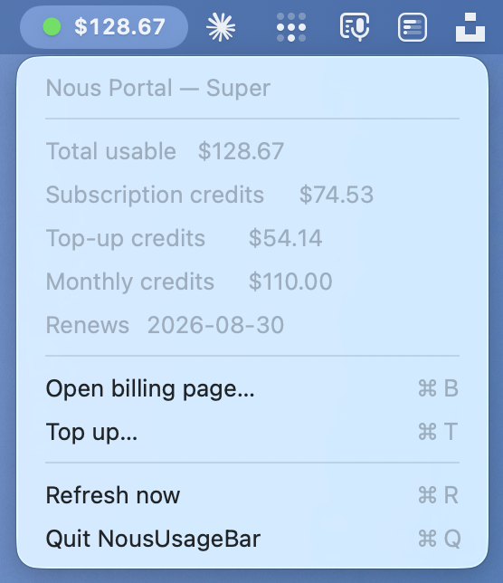

# Nous Usage Bar — macOS menu bar widget

[](https://www.gnu.org/licenses/gpl-3.0)

Live Nous Portal credit balance in your menu bar. Native Swift status item,
backend delegates to Hermes' own Nous account machinery (no credential
handling in the widget).

## Screenshot


## License
GPL-3.0 — see [LICENSE](LICENSE).

## What it shows
- Menu bar: `● $129.10` — total usable credits, colored dot (green > $30, orange > $10, red ≤ $10)
- Click: plan, subscription credits, top-up credits, monthly credits, renewal date
- Menu actions: **Open billing page…** (⌘B), **Top up…** (⌘T), **Refresh now** (⌘R), **Quit** (⌘Q)
- Refreshes every 5 min, plus every time the menu opens

## Files
```
nous-statusbar/
├── NousUsageBar.swift        # native Swift status item app
├── fetch_nous_usage.py       # backend: Hermes account fetch → JSON
├── Info.plist                # LSUIElement (no Dock icon) + AppIcon
├── assets/AppIcon.icns       # generated app icon
├── build.sh                  # reproducible: compile → bundle → sign → DMG+ZIP
└── dist/                     # distributable .dmg + .zip (from build.sh)
```

## Build a distributable
```bash
cd ~/Documents/Hermes/nous-statusbar
./build.sh
```
Produces `~/Applications/NousUsageBar.app` plus
`dist/NousUsageBar-<date>.dmg` and `.zip`.

**Re-generate the icon** (if you want a different one): replace
`assets/appicon-source.png` with any 1024×1024 PNG and re-run `./build.sh`
— it rebuilds the `.icns` automatically.

## Install on another Mac
- Copy `dist/NousUsageBar-<date>.zip` (or mount the `.dmg`), drag
  `NousUsageBar.app` to `~/Applications`, open it once.
- **Requires** a working Hermes install (`~/.hermes/hermes-agent/venv/bin/python`)
  logged into Nous Portal (`hermes portal`). The widget shells out to Hermes'
  own account fetch — it never reads your OAuth token itself.
- Gatekeeper note: the app is **adhoc-signed**, so first launch on a fresh Mac
  needs right-click → Open → Open, or `xattr -dr com.apple.quarantine
  NousUsageBar.app`. Notarization needs an Apple Developer ID (see below).

## Auto-start at login
```bash
launchctl bootstrap gui/$(id -u) ~/Library/LaunchAgents/com.gieldanowski.noususagebar.plist
```
Or System Settings → General → Login Items → + → `NousUsageBar.app`.

## Quit / remove
- Quit: click the widget → **Quit NousUsageBar** (⌘Q)
- Uninstall: quit the app, then:
```bash
rm -rf ~/Applications/NousUsageBar.app
launchctl bootout gui/$(id -u) ~/Library/LaunchAgents/com.gieldanowski.noususagebar.plist 2>/dev/null
rm ~/Library/LaunchAgents/com.gieldanowski.noususagebar.plist
```

## Distribution / notarization (optional, for wide release)
The `.dmg` is adhoc-signed, which is fine locally but triggers a Gatekeeper
warning on other Macs. For frictionless distribution you'd need:
1. An Apple Developer ID certificate (paid account),
2. `codesign --options runtime --sign "Developer ID Application: …"`,
3. Notarize + staple via `xcrun notarytool`.

Happy to wire that up if you have a Developer ID.
